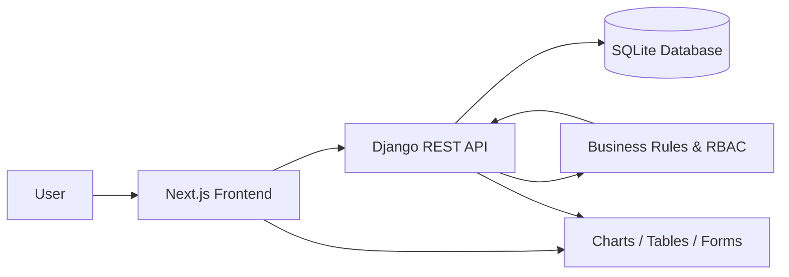
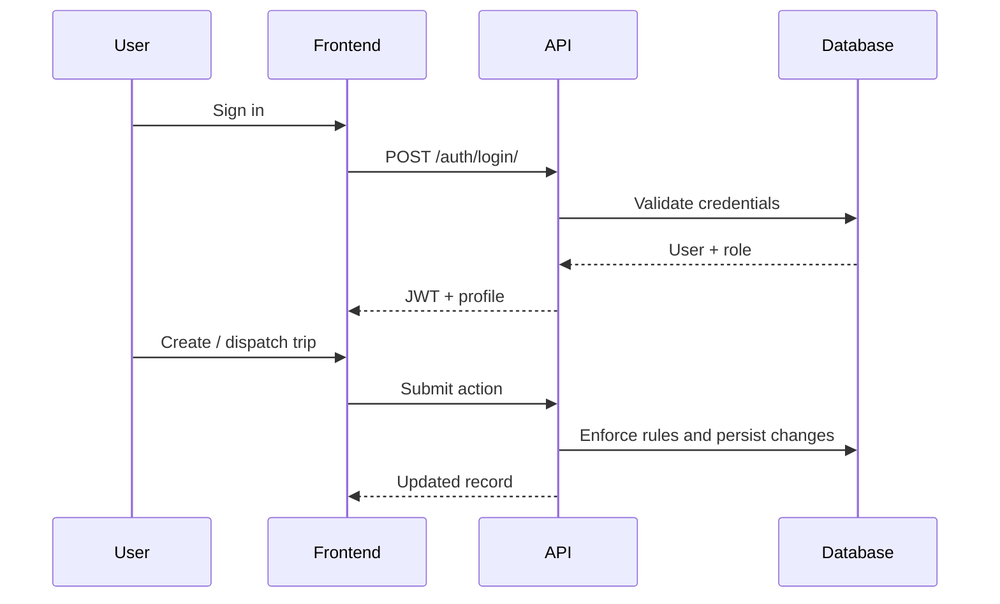

# TransitOps

TransitOps is a smart transport operations platform for managing vehicles, drivers, trips, maintenance, fuel, expenses, and analytics from a single workflow. The project pairs a Django REST backend with a Next.js frontend to provide a role-aware fleet management experience.

## Highlights

- Role-based access for fleet, dispatch, safety, and finance workflows
- Trip lifecycle support from draft to dispatch, completion, and cancellation
- Fleet, driver, maintenance, and finance management screens
- Analytics dashboard with operational KPIs and exportable reporting
- Clean, responsive frontend built with Next.js and Tailwind CSS

## Tech Stack

- Backend: Django, Django REST Framework, SimpleJWT, SQLite
- Frontend: Next.js App Router, React, Tailwind CSS, Axios, TanStack Query, Recharts
- Tooling: Python, Node.js, npm

## Architecture



## Core Workflows



## Repository Layout

```text
TransitOps-solution-RH/
├── backend/
│   ├── manage.py
│   ├── requirements.txt
│   ├── config/
│   └── fleet/
└── frontend/
    ├── app/
    ├── components/
    └── lib/
```

## Getting Started

### Prerequisites

- Python 3.10 or newer
- Node.js 18 or newer

### Backend Setup

```bash
cd backend
python -m venv venv
venv\Scripts\activate
pip install -r requirements.txt
python manage.py migrate
python manage.py seed
python manage.py runserver
```

The API runs at `http://localhost:8000/api/`.

### Frontend Setup

```bash
cd frontend
npm install
npm run dev
```

The frontend runs at `http://localhost:3000`.

## Environment Variables

Backend and frontend may use environment files depending on your local setup.

- Backend: `.env`
- Frontend: `.env.local`

If your workspace already includes sample environment files, copy them before starting the app.

## Features

### Operations

- Vehicle registry with status-aware management
- Driver management with assignment constraints
- Trip dispatch, completion, and cancellation flow
- Maintenance tracking with vehicle state transitions
- Fuel and expense logging for operational visibility

### Analytics

- Fleet utilization metrics
- Cost and fuel efficiency indicators
- Costliest vehicle breakdown
- CSV export for reporting

### Access Control

- Fleet Manager: vehicles and maintenance
- Dispatcher: trips
- Safety Officer: drivers
- Financial Analyst: fuel and expenses

## Business Rules

The backend enforces the following rules server-side:

1. Vehicle registration numbers are unique.
2. Retired and in-shop vehicles are excluded from dispatch selection.
3. Expired-license and suspended drivers cannot be assigned.
4. Vehicles and drivers already on trip cannot be reassigned.
5. Cargo weight cannot exceed vehicle capacity.
6. Dispatching marks both vehicle and driver as on trip.
7. Completing a trip restores both to available.
8. Cancelling a trip restores both to available.
9. Opening maintenance marks the vehicle as in shop.
10. Closing maintenance restores the vehicle to available unless retired.

## API Overview

| Endpoint | Purpose |
| --- | --- |
| `/api/auth/login/` | Authenticate and issue JWT tokens |
| `/api/auth/me/` | Return the authenticated user profile |
| `/api/dashboard/kpis/` | Dashboard metrics |
| `/api/analytics/` | Analytics summary |
| `/api/analytics/export/` | CSV export |
| `/api/vehicles/` | Vehicle CRUD |
| `/api/drivers/` | Driver CRUD |
| `/api/trips/` | Trip CRUD and lifecycle actions |
| `/api/maintenance/` | Maintenance logs |
| `/api/fuel/` | Fuel logs |
| `/api/expenses/` | Expense logs |

## Screens

- Login and access request flow
- Dashboard
- Vehicle registry
- Driver management
- Trip dispatcher
- Maintenance
- Fuel and expenses
- Analytics
- Settings

## Notes

- The app uses seeded data for local development.
- The login screen is intentionally minimal and does not expose demo account details in the UI.
- The frontend includes a separate access-request page for presentation purposes.

## Development Tips

- Run the backend and frontend in separate terminals.
- If you change backend models or serializers, run migrations before restarting the API.
- If frontend changes do not appear, restart the Next.js dev server.

## License

This project was prepared for a hackathon-style transport operations demo.
